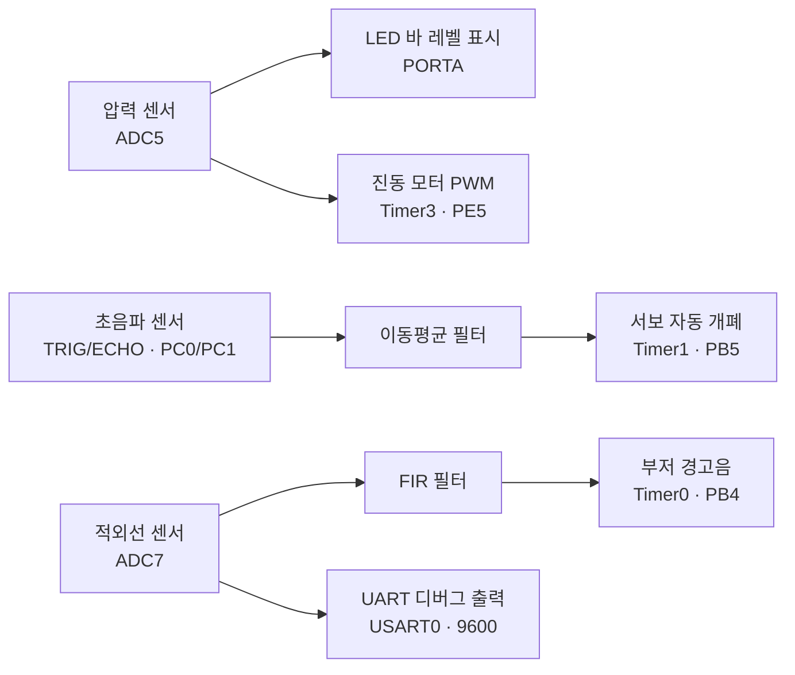

# Smart Waste Processing Facility

> **ATmega128** 기반 무인 스마트 쓰레기 처리장 임베디드 시스템. 압력·초음파·적외선 3종 센서를 실시간으로 읽어 **적재량 표시, 투입구 자동 개폐, 근접 경고**를 수행하며, 초음파에는 이동평균 필터(MAF), 적외선에는 FIR 필터를 베어메탈로 직접 구현했습니다.


---

## 개요

운영체제나 라이브러리 없이 **레지스터 레벨**로 작성된 AVR 펌웨어입니다. 하나의 메인 루프에서 세 개의 독립적인 센서-액추에이터 서브시스템을 동시에 구동합니다.

| 서브시스템 | 입력 센서 | 신호 처리 | 출력 액추에이터 |
|---|---|---|---|
| **적재량 감지** | 압력 센서 (ADC5) | 8단계 레벨 양자화 | LED 바 + 진동 모터(PWM) |
| **투입구 자동 개폐** | 초음파 센서 (PC0/PC1) | 이동평균 필터(MAF) | 서보 모터(PWM) |
| **근접 경고** | 적외선 센서 (ADC7) | 비선형 보정 + FIR 필터 | 부저(가변 주기) |



---

## 주요 기능

### 1. 적재량 감지 (압력 센서)
압력 센서 ADC 값을 8단계로 양자화해 **LED 바로 적재 레벨을 표시**합니다. 동시에 압력 크기에 비례해 **진동 모터의 PWM 듀티를 5단계(20~100%)로 조절**하여 압축·적재 상태를 피드백합니다. (Timer3, `OC3C`/PE5)

### 2. 투입구 자동 개폐 (초음파 센서)
HC-SR04 방식으로 에코 시간을 측정해 거리를 계산하고(`거리 = count / 58`), **이동평균 필터(MAF, 크기 5)** 로 노이즈를 완화합니다. 물체가 가까울수록 서보 각도를 크게 열어 투입구를 자동 개폐합니다. (Timer1 50Hz PWM, `ICR1 = 39999`, `OC1A`/PB5)

### 3. 근접 경고 (적외선 센서)
Sharp 계열 아날로그 IR 센서의 ADC 값을 거리로 변환할 때, 센서 특성 곡선을 반영한 **비선형 보정식**을 적용합니다.

```
거리(cm) = 12343.85 × ADC^(-1.15)
```

이후 **FIR 필터(차수 5)** 로 평활하고, 거리에 따라 **부저 경고 주기를 100~900 ms로 가변**시킵니다(가까울수록 빠르게). 원시/필터링 거리 값은 UART로 실시간 출력됩니다.

---

## 하드웨어 핀 매핑 (ATmega128)

| 기능 | 핀 | 주변장치 |
|---|---|---|
| 압력 센서 | ADC5 (PF5) | ADC |
| 적외선 센서 | ADC7 (PF7) | ADC |
| LED 바 (8ch) | PORTA (PA0–PA7) | GPIO |
| 진동 모터 | PE5 | Timer3 Fast PWM (`OC3C`) |
| 초음파 TRIG / ECHO | PC0 / PC1 | GPIO + 타이밍 측정 |
| 서보 모터 | PB5 | Timer1 PWM (`OC1A`, 50Hz) |
| 부저 | PB4 | Timer0 Fast PWM (`OC0`) |
| UART 디버그 | PE1 (TXD) | USART0, 9600 8N1 |

> 시스템 클럭은 **외부 16 MHz** 크리스털을 가정합니다 (`F_CPU = 16000000UL`).

---

## 임베디드 설계 포인트

- **다중 하드웨어 타이머 병렬 운용** — Timer0(부저)·Timer1(서보)·Timer3(진동 모터)를 각각 독립 PWM으로 구성
- **두 종류의 디지털 필터를 직접 구현** — 초음파에는 이동평균(MAF), 적외선에는 FIR(차수 5). 링 버퍼 기반으로 메모리·연산 최소화
- **아날로그 센서 비선형 캘리브레이션** — IR 센서의 역거듭제곱 특성을 보정식으로 반영
- **에코 타이밍 기반 거리 측정** — 타임아웃 처리를 포함한 초음파 왕복 시간 계측
- **센서→액추에이터 실시간 매핑** — 거리/압력 값을 서보 각도·PWM 듀티·부저 주기로 선형 변환

---

## 빌드 & 업로드

**Microchip(Atmel) Studio 사용**
1. `final.atsln` 을 Microchip Studio에서 열기
2. 디바이스가 **ATmega128** 인지 확인
3. `Build → Build Solution` (F7)
4. ISP 프로그래머로 `Tools → Device Programming` 에서 플래시 write

**avrdude(CLI) 사용 — USBasp 예시**
```bash
avrdude -c usbasp -p m128 \
  -U flash:w:final_jaewonboard/Debug/final_jaewonboard.hex:i
```

빌드 산출물(`.hex`, `.elf`, `.eep` 등)은 `final_jaewonboard/Debug/` 에 있습니다.

---

## 프로젝트 구조

```
Smart-Waste-Processing-Facility/
├── final.atsln                     # Microchip Studio 솔루션
└── final_jaewonboard/
    ├── main.cpp                    # ★ 전체 펌웨어 (센서·필터·액추에이터 제어)
    ├── final.cppproj               # 프로젝트 설정
    └── Debug/                      # 빌드 산출물 (.hex / .elf / .map ...)
```

---

## 한계 및 향후 개선

**현재 한계**
- 메인 루프가 `_delay_ms` 기반의 **블로킹 구조** — 부저 딜레이 동안 다른 센서 갱신이 지연됨
- 센서 임계값·필터 계수가 하드코딩 — 환경 변화에 대한 적응성 부족
- 압력 센서 값의 물리 단위(kg 등) 캘리브레이션은 미적용

**향후 개선 방향**
- 타이머 인터럽트 기반 **논블로킹 스케줄링**으로 전환(부저를 인터럽트 구동)
- 실측 기반 센서 캘리브레이션 및 임계값 파라미터화
- 적재량 초과 시 원격 알림(무선 모듈) 연동

---

## 기술 스택

`C++ (Embedded)` · `ATmega128` · `AVR-GCC` · `Microchip Studio` · `ADC` · `Timer/PWM` · `USART` · `Digital Filtering (MAF / FIR)`
